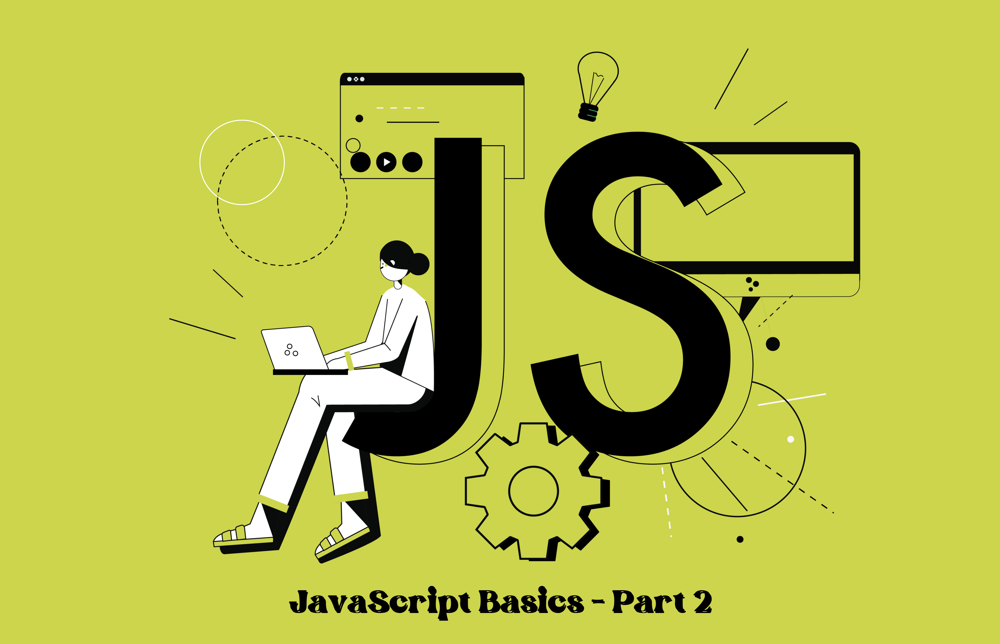

# Learn-JavaScript-Basics-part2
JavaScript is the <b>most popular programming language</b> in the world. This is the programming language of the web. This is the second part of JavaScript basics. There are simple examples for each basic concept.

I have created this repository while refreshing my memory about JavaScript. To refresh my memory, I used the videos of <b>Triplebee YouTube channel</b>.

link for the channel : <a href="https://www.youtube.com/@thriplebee">https://www.youtube.com/@thriplebee</a>

